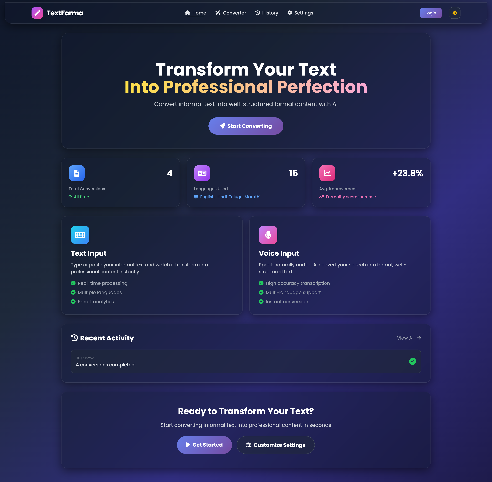
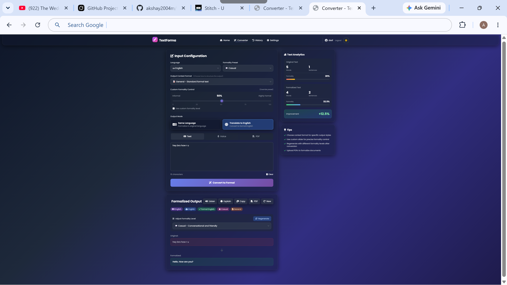
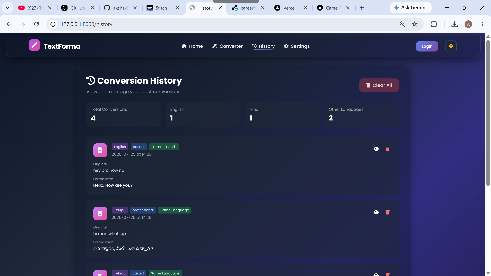
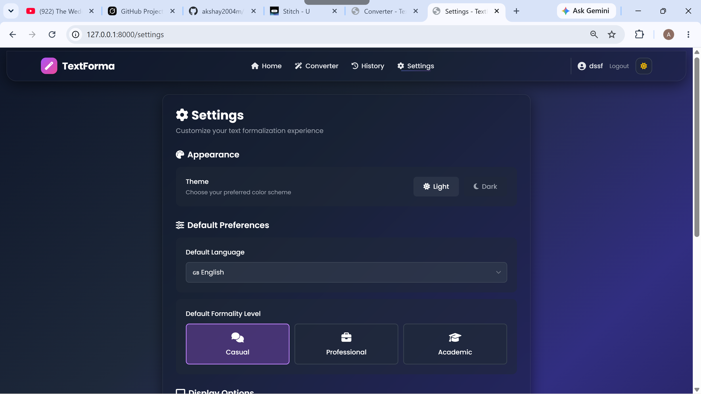

# AI Text Formalizer & Multilingual Translator

An advanced, AI-powered tool designed to elevate everyday communication by converting casual or raw text into polished, professional formats. Whether you're drafting an email, structuring meeting notes, or writing a formal proposal, this application provides context-aware translations and text formalization across more than 10 languages, giving you precise control over tone and formality.

## Key Features

- **Gemini-powered Formalization:** Leverages the Google Gemini API to intelligently rewrite and elevate text to professional standards.
- **Context-Aware Formatting:** Tailor the output to specific document types, including Emails, Reports, Meeting Notes, Presentations, Proposals, Legal documents, and Academic writing.
- **Adjustable Formality Score (0-100):** Dial in the exact level of professionalism required, moving beyond simple labels for fine-grained tone control.
- **Multi-Language Support:** Process and translate text in English, Hindi, Telugu, Marathi, Tamil, Bengali, Gujarati, Malayalam, Kannada, Spanish, French, German, Japanese, Mandarin, and Hinglish.
- **PDF I/O Support:** Easily upload PDFs for text extraction and export your finalized, formalized documents directly back to PDF.
- **Voice-to-Text Input:** Speak your thoughts naturally—audio is captured and transcribed seamlessly for processing.
- **Secure OAuth Login:** Authenticate users safely with built-in Google and Microsoft OAuth integrations.
- **Conversion History & Analytics:** Backed by SQLite, it tracks your usage history and visualizes the "formality improvement" of your texts over time.

## Tech Stack

- **Backend:** Flask
- **AI/LLM:** Google Gemini API
- **Document Processing:** PyPDF2, ReportLab
- **Audio Processing:** SpeechRecognition + FFmpeg
- **Authentication:** Authlib (OAuth)
- **Database:** SQLite

## Architecture Flow

1. **User Input:** The user provides text (via typing, voice, or PDF upload) and selects the desired language, context format, and formality level.
2. **AI Processing:** The backend constructs a prompt with explicit formality instructions and contextual structure, sending it to the Gemini API.
3. **Streamed Response:** Gemini processes the prompt and streams the finalized text back to the user interface for low perceived latency.
4. **Formality Scoring & Analytics:** The output is evaluated to calculate a formality score, comparing it against the original text to generate an "improvement score."
5. **Persistence:** The original text, formalized output, and analytical metadata are stored in the SQLite database for historical tracking.

## Setup Instructions

1. **Clone the repository:**
   ```bash
   git clone https://github.com/akshay2004m/TextaForma.git
   cd TextaForma
   ```

2. **Create and activate a virtual environment:**
   ```bash
   python -m venv venv
   # On Windows:
   venv\Scripts\activate
   # On macOS/Linux:
   source venv/bin/activate
   ```

3. **Install the required dependencies:**
   ```bash
   pip install -r requirements.txt
   ```

4. **Configure Environment Variables:**
   Create a `.env` file from the provided `.env.example` file and fill in your API keys:
   ```bash
   cp .env.example .env
   ```
   *Required Keys: `GEMINI_API_KEY`, `FLASK_SECRET_KEY`, `GOOGLE_CLIENT_ID`, `GOOGLE_CLIENT_SECRET`, `MICROSOFT_CLIENT_ID`, `MICROSOFT_CLIENT_SECRET`.*

5. **Install FFmpeg:**
   FFmpeg is required for audio transcription. 
   - [Download and install FFmpeg](https://ffmpeg.org/download.html), ensuring it is added to your system's PATH.

6. **Run the Application:**
   ```bash
   python app.py
   ```
   Open your browser and navigate to `http://127.0.0.1:8000/`.

## Screenshots

<div align="center">
  
  <br>
  <em>Home Dashboard</em>
</div>
<br>
<div align="center">
  
  <br>
  <em>Converter Interface</em>
</div>
<br>
<div align="center">
  
  <br>
  <em>History Analytics</em>
</div>
<br>
<div align="center">
  
  <br>
  <em>Settings Page</em>
</div>

## Design Decisions

- **Streaming Responses:** We implemented response streaming from the Gemini API. Instead of waiting for the full response to generate, chunks are delivered immediately to the frontend, drastically improving the perceived latency and UX.
- **Custom Formality Scoring:** Instead of relying on rigid categorical labels (e.g., "casual" vs. "formal"), we calculate a 0-100 formality score. This allows for finer-grained evaluation of output quality and measurable "improvement" analytics over time.
- **FFmpeg for Audio:** We chose FFmpeg alongside SpeechRecognition because it provides broad format support (like `.webm` from browser microphones), standardizing audio input before passing it to transcription models.
